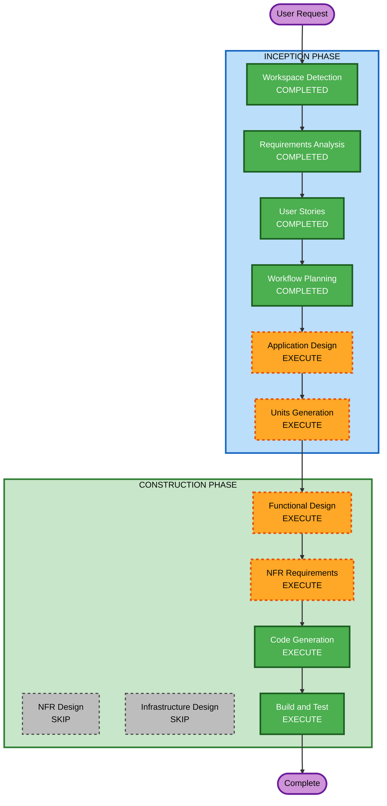

# Execution Plan: 走った風になるアプリ

## Detailed Analysis Summary

### Change Impact Assessment
- **User-facing changes**: Yes — 完全に新規のユーザー向けWebアプリケーション
- **Structural changes**: Yes — フロントエンド + バックエンドプロキシの新規構築
- **Data model changes**: No — MVPではデータ永続化なし（将来的に追加）
- **API changes**: Yes — Google Maps Platform APIとの連携、バックエンドプロキシAPI
- **NFR impact**: Moderate — パフォーマンス（画像表示のスムーズさ）が体験品質に直結

### Risk Assessment
- **Risk Level**: Medium
- **Rollback Complexity**: Easy（新規プロジェクトのため、ロールバック不要）
- **Testing Complexity**: Moderate（API連携、リアルタイム表示のテスト）

---

## Workflow Visualization



### Text Alternative

```
INCEPTION PHASE:
  [COMPLETED] Workspace Detection
  [COMPLETED] Requirements Analysis
  [COMPLETED] User Stories
  [COMPLETED] Workflow Planning
  [EXECUTE]   Application Design
  [EXECUTE]   Units Generation

CONSTRUCTION PHASE:
  [EXECUTE]   Functional Design (per unit)
  [EXECUTE]   NFR Requirements (per unit)
  [SKIP]      NFR Design
  [SKIP]      Infrastructure Design
  [EXECUTE]   Code Generation (per unit)
  [EXECUTE]   Build and Test
```

---

## Phases to Execute

### INCEPTION PHASE
- [x] Workspace Detection (COMPLETED)
- [x] Requirements Analysis (COMPLETED)
- [x] User Stories (COMPLETED)
- [x] Workflow Planning (COMPLETED)
- [ ] Application Design - **EXECUTE**
  - **Rationale**: 新規プロジェクトで複数コンポーネント（フロントエンド、バックエンドプロキシ、API連携層）が必要。コンポーネント間の責務分担とインターフェースを明確にする必要がある。
- [ ] Units Generation - **EXECUTE**
  - **Rationale**: フロントエンド（UI + Canvas描画）とバックエンド（APIプロキシ）の2つ以上のユニットに分解し、並行開発可能な単位を定義する必要がある。

### CONSTRUCTION PHASE
- [ ] Functional Design - **EXECUTE** (per unit)
  - **Rationale**: ルート計算ロジック、Street View画像取得・表示ロジック、カロリー計算ロジック等のビジネスロジックの詳細設計が必要。
- [ ] NFR Requirements - **EXECUTE** (per unit)
  - **Rationale**: 画像表示のパフォーマンス要件、APIレート制限対応、技術スタック選定（フレームワーク、Canvas vs WebGL等）が必要。
- [ ] NFR Design - **SKIP**
  - **Rationale**: MVPは小規模（数十人）でセキュリティ拡張もスキップ。NFRパターンの詳細設計は不要。NFR Requirementsで技術スタックを決定すれば十分。
- [ ] Infrastructure Design - **SKIP**
  - **Rationale**: MVPはシンプルなWebアプリ（静的ホスティング + 軽量APIプロキシ）。複雑なインフラ設計は不要。デプロイ先はCode Generation時に決定。
- [ ] Code Generation - **EXECUTE** (ALWAYS, per unit)
  - **Rationale**: 実装コードの生成が必要。
- [ ] Build and Test - **EXECUTE** (ALWAYS)
  - **Rationale**: ビルド・テスト手順の策定が必要。

### OPERATIONS PHASE
- [ ] Operations - PLACEHOLDER
  - **Rationale**: 将来のデプロイ・監視ワークフロー用。現時点では対象外。

---

## Estimated Timeline
- **Total Stages to Execute**: 6（Application Design, Units Generation, Functional Design, NFR Requirements, Code Generation, Build and Test）
- **Estimated Interactions**: 各ステージ1〜2回のやり取り

## Success Criteria
- **Primary Goal**: MVPとして動作するバーチャルランニング体験Webアプリの完成
- **Key Deliverables**:
  - コース指定UI（地図上でスタート/ゴール選択）
  - Street View画像のリアルタイム連続表示（走っている風の体験）
  - 現在位置のミニマップ表示
  - 罪悪感解消の演出（距離・カロリー・時間カウンター）
  - 共犯者トーンのメッセージ表示
  - 完走時の演出
- **Quality Gates**:
  - 画像表示がスムーズ（カクつかない）
  - 初回ロード3秒以内
  - モダンブラウザ（Chrome, Firefox, Safari, Edge）で動作
